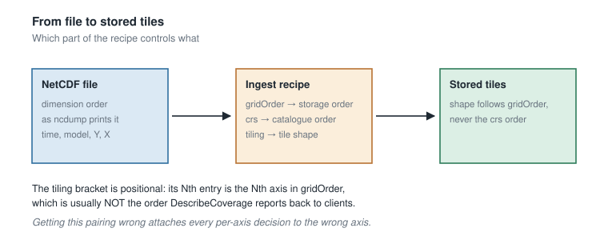
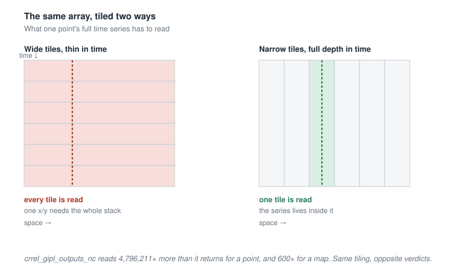
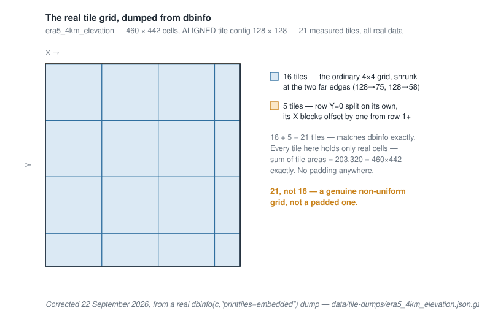
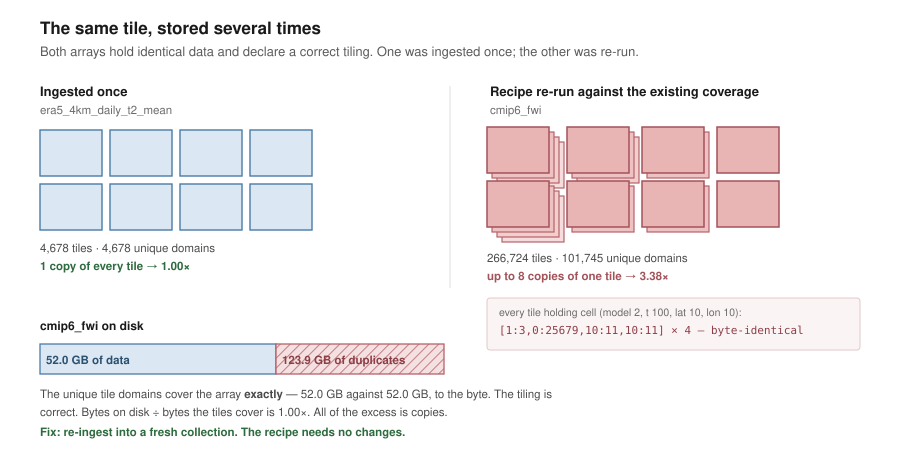

# Rasdaman Tiling Guide

How a netCDF file becomes stored tiles, what those tiles cost you, and how to
choose a tiling that matches how the data will actually be queried.

Read this before the [tiling audit](rasdaman-tiling-audit.md), which applies
these ideas to the coverages on our server.

---

## 1. The one idea everything rests on

**A tile is the smallest unit rasdaman reads.** Ask for a single cell and the
server fetches, decompresses and hands back the entire tile containing it.

That single fact drives every decision below. It means the *shape* of a tile
matters more than its size, because the shape decides how much irrelevant data
comes along with every answer. A tiling that is excellent for drawing a map can
be catastrophic for reading a time series at one point, and nothing about the
ingest will warn you.

---

## 2. The pipeline

Three things travel from the source file into storage, and they are easy to
confuse because they describe the same axes in different orders.



Start with `ncdump -h`. The dimension list on your target variable is the
single source of truth for how the file is physically laid out:

```
float magt05m_degC(time, model, scenario, y, x) ;
```

**`gridOrder`** is each axis's 0-indexed position in that tuple, left to right,
exactly as printed — no reversal, no arithmetic. Here `time=0, model=1,
scenario=2, y=3, x=4`. It tells wcst_import which dimension of the source array
feeds which named axis, *and* it fixes the order rasdaman stores the array in.

**`crs`** is an `@`-joined string whose expanded axis order is what OGC clients
see — what `DescribeCoverage` reports. It does not need to match the file's
order:

```
"crs": "OGC/0/Index1D?axis-label=\"model\"@OGC/0/Index1D?axis-label=\"scenario\"@OGC/0/AnsiDate?axis-label=\"time\"@EPSG/0/3338"
```

That groups the index axes first, then time, then the two spatial axes from
`EPSG/0/3338` — a deliberate presentation choice, unrelated to storage.

**`tiling`** lists one range per axis **in `gridOrder` order**, not `crs` order:

```
"tiling": "REGULAR [<time>, <model>, <scenario>, <Y>, <X>] tile size N"
```

This is the pairing people get wrong, and it is worth stating bluntly: **the
tiling bracket is positional, and its Nth entry is the Nth axis in `gridOrder`.**
Since `crs` order is usually different, reading the bracket against `crs` will
attach every chunk size to the wrong axis. Section 9 shows how to confirm which
is which on a coverage that already exists.

> **The spatial pair is its own trap.** `ncdump` commonly lists `y, x`, while
> `EPSG:3338` declares Easting (X) before Northing (Y). Both are correct; they
> describe different things. Most projected CRSs (UTM, State Plane, Albers, Web
> Mercator) put X first, while the EPSG registry declares geographic CRSs like
> `EPSG:4326` as **latitude before longitude** — the opposite of the `lon,lat`
> convention most GIS software uses. Check the CRS rather than assuming.

---

## 3. What a tile costs you

Three distinct costs, which get confused constantly. Only the first two are
about tile shape at all — the first always bites, the second is mostly harmless,
and the third, which is where the real money goes, turns out to have nothing to
do with how you tile.

### 3.1 Read amplification — the cost that always bites

**Read amplification is bytes read ÷ bytes the query actually wanted.** A tile
is indivisible, so rasdaman must fetch and decompress every tile your query
touches, in full, and then throw away the parts you didn't ask for. If you want
one cell and the tile holds a million, you read a million. Amplification of 1×
means you read exactly what you asked for; 600× means you read six hundred times
more than you kept.

It depends entirely on whether the tile's shape resembles the query's shape.



Our permafrost coverage `crrel_gipl_outputs_nc` makes the point. It is
100 × 3 × 2 × 1941 × 2471 cells — 2,877,726,600 in total — and its tile spans
the *entire array*. So every query, whatever it asks for, reads all of it:

| Query | Wants | Reads | Amplification |
|---|---|---|---|
| Full time series at one x/y | 600 cells | 2,877,726,600 | **4,796,211×** |
| One full map frame | 4,796,211 cells | 2,877,726,600 | **600×** |

The second row is the one that trips people up. A map frame reads "one tile,"
which sounds efficient — but one tile here *is* the whole array, and a frame is
only 1/600th of it. You wanted one map; you read all six hundred maps to get it.
It would be 1× only if the tile held exactly one frame and nothing else.

Note the symmetry: each row's "wants" is the other row's amplification factor.
That is not a coincidence — it falls out of the two queries slicing the same
array along complementary axes.

Same tiling, same data, two answers three orders of magnitude apart. The tiling
is not badly built in the abstract; it is built for the wrong question. Most of
our coverages serve point and small-AOI lookups, so the first row is the one
that counts.

The rule that follows: **keep the axes a query sweeps inside one tile, and chunk
the axes it pins.** For a point time series, that means the whole time axis in
one tile and a small spatial footprint.

### 3.2 Padding — real, but cheaper than it looks

A tile grid has to cover the array, so unless every axis divides evenly by its
chunk size, the grid overruns the edges. Those boundary tiles are materialised
at full size regardless.



`era5_4km_elevation` is 460 × 442 cells tiled at 128 × 128. Neither axis
divides evenly, so the grid runs to 512 × 512 — **262,144 cells of tile to hold
203,320 cells of data, 22% dead.**

Here is the part that surprises people, and that our own measurements settled:
**that dead space costs almost nothing on disk.** Rasdaman compresses tiles, and
zero-fill compresses to near nothing. Across our server, 19 of the 22 coverages
with more than 1.2× geometric padding show no disk penalty at all —
`design_freezing_index` carries 109× geometric padding and still sits at 0.56×
its uncompressed size.

What padding *does* cost is read I/O, every single time, because the tile is
fetched and decompressed whole before anything is discarded. So padding is
worth avoiding, but for latency reasons, not disk reasons — and the fix is to
pick chunk sizes that divide the axis, or to use `ALIGNED`, which shrinks
boundary tiles instead of padding them.

### 3.3 Duplicate tiles — where the storage actually went

**The same tile domain, stored more than once.** Not a tiling defect at all:
rasdaman holds several byte-identical copies of a tile, and you pay for each.



Here is one cell of `cmip6_fwi` — model 2, time 100, lat 10, lon 10 — and every
tile in the collection that contains it:

```
[1:3,0:25679,10:11,10:11]
[1:3,0:25679,10:11,10:11]
[1:3,0:25679,10:11,10:11]
[1:3,0:25679,10:11,10:11]
```

Four identical domains. Nothing is overlapping or misaligned; the tile is simply
there four times.

#### What the tile dump shows

Three coverages, tile domains dumped in full and counted:

| | tiles | unique domains | duplicate bytes | array | on disk |
|---|---|---|---|---|---|
| `era5_4km_daily_t2_mean` | 4,678 | 4,678 | 0 GB | 19.0 GB | 19.0 GB (1.00×) |
| `era5_4km_daily_t2_mean_wcs` | 7,642 | 6,553 | 6.1 GB | 19.0 GB | 25.1 GB (1.32×) |
| `cmip6_fwi` | 266,724 | 101,745 | 123.9 GB | 52.0 GB | 175.9 GB (3.38×) |

The unique domains cover **exactly** the array — 19.0 GB against 19.0 GB, 52.0
against 52.0, to the byte. So the declared tiling did precisely what it was
asked to do in every case. There is no padding waste here, no subdivision, no
misalignment. Bytes on disk divided by bytes the tiles cover is 1.00× for all
three. Every gram of overhead is a second, third or fourth copy.

For `cmip6_fwi` the copies-per-domain distribution is uneven: 27,290 domains
stored once, 29,847 twice, 41,218 four times, 800 eight times.

#### A second, accidental experiment

Someone once ingested `era5_4km_daily_t2_mean` three times at three different
tile sizes and left the results on the server. All three hold the identical
array:

| collection | tiles | on disk |
|---|---|---|
| `bigger_tile_era5_4km_daily_t2_mean` | 289 | 19.011 GB |
| `big_tile_era5_4km_daily_t2_mean` | 1,172 | 19.011 GB |
| `era5_4km_daily_t2_mean` (live) | 4,678 | 19.011 GB |

A sixteen-fold difference in tile count, and the byte totals are identical to
three decimal places. **Tile count and tile size do not affect how much disk a
coverage occupies.** Only duplicates do. Choose your tiling for query
performance and ignore storage entirely when making that decision.

Six coverages have now had their domains dumped and counted, spanning the whole
range of overhead. The worst multiplicity tracks the storage cost closely:

| coverage | overhead | most copies of one domain |
|---|---|---|
| `iem_cru_2km_taspr_seasonal` | 1.55× | 3 |
| `era5_4km_daily_t2_mean_wcs` | 1.32× | 4 |
| `cmip6_fwi` | 3.38× | 8 |
| `tas_2km_projected_wcs` | 7.41× | 16 |
| `conus_hydro_segments_stats_combined` | 12.64× | 16 |

So for every coverage in the re-ingest queue, `total_size` minus
(cells × bytes-per-cell) *is* the duplicate count, and the spreadsheet's
reclaimable column can be read directly.


#### Why it happens

That unevenness is the clue. A region touched by one write has one copy; a
region touched by four writes has four. The arrays were written into more than
once — `wcst_import` re-run against a coverage that already existed, each pass
laying down another copy of the tiles it touched instead of replacing them.

It explains the pattern across the server. Coverages ingested once and left
alone sit at 1.00×. The ones that were iterated on during development —
typically the `_wcs` variants, tuned and re-run until the tiling looked right —
carry the duplicates. `tas_2km_projected_wcs` at 7.41× is the extreme case.

#### What this means for tiling decisions

**Nothing.** Tile shape, `0:*` versus explicit bounds, the `tile size` budget,
`REGULAR` versus `ALIGNED` — none of it causes or prevents duplication. A
point-optimised pencil is not more expensive to store than a default cube. The
tiling in these recipes was correct; the arrays were just written twice.

Do not re-tile to fix this, and do not let a high storage overhead push you into
changing a tiling that serves your queries well.

#### The rule

**Re-ingest into a fresh collection. Never re-run `wcst_import` against a
coverage that already exists.** Delete the coverage first, or ingest under a new
name and swap. `cmip6_fwi` goes from 175.9 GB to 52.0 GB with its recipe
completely unchanged.

To check a coverage of your own, dump the domains and count them:

```bash
curl -u rasadmin:$PASSWORD \
  --data-urlencode 'query=select dbinfo(c,"printtiles=embedded") from $COLLECTION as c' \
  'https://<host>/rasdaman/rasql' > tiles.json

grep -a -o '"\[[-0-9:,]*\]"' tiles.json | sort | uniq -c | sort -rn | head
```

Any count above 1 in that output is a duplicate. If the top line reads `1`, the
coverage is clean.

On our server, 247 of 273 coverages are clean at 1.05× or better. Twenty-six
carry the whole 4,591 GB of excess, and one coverage,
`tas_2km_projected_wcs`, accounts for 2,009 GB of it.

---

## 4. Sizing a tile

Rasdaman's guidance is that **1–4 MB per tile is optimal in most cases**.

The byte budget is the trap:

```
tile bytes = (product of the tile's per-axis extents) × (sum of every band's byte width)
```

**Every band counts, not one.** Rasdaman's Storage Layout Language paper makes
this unambiguous with its own worked example: a 3-band RGB image tiled 512 × 512
declares `tile size 786432`, and 512 × 512 × 3 × 1 byte = 786,432 exactly.

For a 10-band `float32` coverage that is **40 bytes per cell**, not 4. Planning
against one band's width under-counts the real footprint by the band count —
a tenfold error that no validation catches, because nothing was technically
violated.

---

## 5. `REGULAR` vs `ALIGNED`

**`REGULAR [ranges] tile size N`** declares an exact tile shape, replicated
across the array. Boundary tiles are still built at full declared size, with
the overhang zero-filled — the padding of Section 3.2. It also **cannot be
combined with `"irregular": true`** on any axis; every axis must be a plain
evenly-spaced numeric sequence.

**`ALIGNED [0:*, ...] tile size N`** lets rasdaman derive the shape to hit a
byte target, and per its documentation "the tiles at the borders will be
adjusted to fit in the domain" — it shrinks boundary tiles rather than padding
them. It is the better default when axis sizes don't factor conveniently.

Neither scheme affects how much disk the coverage uses. The choice is about
boundary reads: `REGULAR` fetches a full-size tile at every edge, `ALIGNED`
fetches a smaller one.

A wildcard is a real delegation of control. `ALIGNED [0:*, 0:31, 0:31] tile size
16777216` pins the spatial chunks at 32 and lets rasdaman choose the first axis;
on an 18,250-step time axis with one float band it chooses 4,096, giving a
4096 × 32 × 32 tile. That is a decision you did not make, and it may not suit
your query pattern.

**String-valued axes** (a `model` coordinate stored as netCDF strings) can't be
used with `REGULAR` directly, since rasdaman can't store strings as axis
coefficients. The usual fix is a small Python lookup module — loaded via a
`statements` block, e.g. `imp.load_source('luts', os.getenv('LUTS_PATH'))` —
mapping each label to a sequential integer (`'5ModelAvg' → 0`). Once every axis
is numeric, `REGULAR` becomes available.

---

## 6. Choosing a tiling

Start from the question the coverage exists to answer — and only that question.
Sections 3.2 and 3.3 settled the storage side: **tile shape, tile size and tile
count do not change how much disk a coverage occupies.** The three-way
`era5_4km_daily_t2_mean` experiment proved it at 289, 1,172 and 4,678 tiles for
an identical 19.011 GB. So tiling is a pure read-performance decision. Choose
for queries and ignore disk.

**For point and small-AOI reads** — the dominant pattern for our data — keep
every non-spatial axis whole inside a tile and make the spatial footprint as
small as a sane tile size allows. One tile then answers a whole time series.

**For map rendering (WMS)** — do the opposite: pin the non-spatial axes to one
index each and make the spatial footprint large.

**Identify the axis that is large relative to the others** and chunk that one.
A stream dataset with 56,460 site IDs and a handful of small categorical axes
wants `stream_id` chunked to 1 and everything else at full extent: one tile per
site, one tile per query.

The trade-off is visible directly in our own measurements. These three hold
climate data on the same 460 × 442 grid, tiled three different ways:

| Coverage | Tile | Point query | Map query |
|---|---|---|---|
| `era5_4km_daily_t2_mean` | rasdaman's choice — 5 × 460 × 442 | 203,320× | 46,752× |
| `era5_4km_daily_t2_mean_wcs` | whole time axis, 8 × 8 spatial | **64×** | 23,899× |
| `cmip6_fwi` | whole time axis, 2 × 2 spatial | **4×** | 128,626× |

Shrinking the spatial footprint from a full frame to 8 × 8 improves point reads
by a factor of three thousand. Going further to 2 × 2 gets you to 4×, close to
the floor — but the map query degrades from 24,000× to 129,000×, because a map
frame now has to assemble tens of thousands of tiny tiles.

The first two rows hold the *identical array* and occupy the same space for it.
`era5_4km_daily_t2_mean_wcs` reports 1.32× on disk, but that is 6.1 GB of
duplicate tiles from a re-run ingest (Section 3.3), not a cost of its tiling. Had
it been ingested once it would sit at 19.0 GB, exactly like its sibling, while
answering point queries three thousand times faster.

So the middle row is the one to copy. A spatial footprint of roughly 8 × 8 to
12 × 12 with the sweep axis kept whole captures nearly all of the point-query
benefit without making the coverage useless for maps, and it costs nothing
extra to store.

---

## 7. Worked examples

**Stream-segment dataset.** Native dimensions `era=4, doy=366, landcover=2,
model=14, scenario=5, stream_id=56460`; `gridOrder`, `crs` and `tiling` all use
that same order here (valid, though not required).

```
"tiling": "REGULAR [0:3, 0:365, 0:1, 0:13, 0:4, 0:0] tile size 1048576"
```

Every axis at full extent except `stream_id`, chunked to 1. Divisibility is
automatic — full extent divides itself, and 1 divides anything. Cells per tile:
4 × 366 × 2 × 14 × 5 × 1 = 204,960.

**Gridded permafrost dataset.** Native dimensions `time=100, model=3,
scenario=2, y=1941, x=2471`, so `gridOrder` is `time=0, model=1, scenario=2,
y=3, x=4` and the bracket follows that order. Chunking the spatial axes on their
actual divisors — 647 for Y (3 blocks), 353 for X (7 blocks):

```
"tiling": "REGULAR [0:0, 0:0, 0:0, 0:646, 0:352] tile size 9135640"
```

Cells per tile: 647 × 353 = 228,391. At 10 `float32` bands that's 228,391 × 40 =
9,135,640 bytes. Both chunk sizes divide exactly, so there is no padding.

**The catch worth internalising:** those chunk sizes are only exact divisors in
one specific assignment — 353 on X (2471 = 7 × 353) and 647 on Y (1941 = 3 ×
647). A real ingest transposed them, putting 647 on X and 353 on Y. Neither axis
divided evenly any more, and both ends now pad. The **tile count** rose by
exactly 8/7 — which is what the original investigation noticed, 14,400 tiles
where 12,600 were expected:

```
⌈2471 ÷ 647⌉ = 4 blocks → 2588 covered (117 padded)
⌈1941 ÷ 353⌉ = 6 blocks → 2118 covered (177 padded)
4 × 6 = 24 spatial blocks, where 7 × 3 = 21 was intended
```

The total byte arithmetic still checked out perfectly, because tile volume does
not care which axis contributed which factor. **Only a per-axis divisibility
check catches a transposition.**

Note what this did and did not cost. More tiles and padded edges mean more bytes
fetched and decompressed on every read — a latency cost, paid forever. They do
not mean more disk: the padding compresses away (Section 3.2) and the tile count
is irrelevant to storage (Section 3.3). A transposition is a performance bug, not
a capacity one.

---

## 8. When the math is wrong

Rasdaman has hard-failure errors for structural tiling problems — error 219
(tile size smaller than the base type), 220 (tiling strategy incompatible with
the marray), 224 (tile configuration incompatible with the marray domain). None
of them fire for the most likely mistake, which is sizing a tile against one
band instead of all of them.

What happens instead depends on the bracket:

- **With wildcards**, rasdaman solves for a shape that hits your declared byte
  target using the *true* multi-band cell width. If you picked the target using
  one band, the tiles it builds land at roughly (band count) × the size you
  intended — silently, because nothing was violated.
- **With an explicit bracket**, the bracket determines the shape; the `tile size`
  number is descriptive. An inaccurate number means your estimate was wrong, not
  that rasdaman built something different.

Either way there is no error naming the cause. It surfaces as an ingest that is
slow and memory-hungry — tiles that overflow the configured tile cache
(`--cachelimit`) spill to disk, and when tiles are several times larger than
planned, that is consistent with exhausting RAM rather than failing cleanly.

---

## 9. Verifying what was actually built

Planning is Sections 1–8. This is how to check what exists.

```bash
curl -u rasadmin:$PASSWORD \
  -d 'query=select dbinfo(c) from $COVERAGE_ID as c' \
  'https://<host>/rasdaman/rasql'
```

The fields that matter: `baseType` (count and type of every band, so you can
read the true per-cell width), `tileNo` (tiles actually created), `totalSize`
(bytes actually persisted), and `tiling.tileConfiguration` (the tile shape).

Adding `dbinfo(c,"printtiles=embedded")` also lists every individual tile
domain. Be careful with it: on a coverage with millions of tiles the response
is large enough to arrive truncated.

**Five checks worth running.**

*Did it build the grid I asked for?* Compute the tile count the geometry
requires — `∏ ⌈extent ÷ chunk⌉` — and compare against `tileNo`. Equal means the
tiling behaved. Lower means sparse materialisation, which is fine. Higher does
**not** by itself mean anything is wrong: a wildcard bracket makes the geometric
count meaningless, and `era5_4km_daily_t2_mean` scores 2,339× by this test while
storing at exactly 1.00×.

*Am I paying for the array more than once?* This is the one that finds real
money. Divide `totalSize` by (cells × bytes-per-cell). Above about 1.05 means
duplicate tiles (Section 3.3), which the domain dump confirms directly.

*Is there padding?* Check each axis separately: `extent % chunk == 0`. The byte
arithmetic will look right even when two chunk sizes are transposed, so only the
per-axis check catches that.

*Which axis is in which bracket position?* Read `tiling.tileDomains` and match
the distinct values at each position against each axis's known cardinality — a
position cycling through 2 or 3 values is a small categorical axis. This is more
reliable than trusting how the recipe was written.

*Is this even the right array?* A successful `dbinfo` is not proof. `wcst_import`
does not always name the collection after the coverage, so a collection can sit
at a coverage's name while holding something else entirely — we found twelve such
cases, including two where `dbinfo` returned a single 4-byte cell while WCS
served real data from elsewhere. Cross-check the domain against the WCPS probe
below, and get the authoritative name from petascope rather than guessing:

```sql
SELECT c.coverage_id, r.collection_name
  FROM coverage c
  JOIN rasdaman_range_set r ON r.rasdaman_range_set_id = c.rasdaman_range_set_id;
```

### Two gotchas in the output

**`tileConfiguration` can contain `*`.** An unbounded axis is reported as `0:*`,
not a number. Parsing only numeric ranges silently drops that position and
misaligns everything after it.

**`sdom` and `tileConfiguration` are in storage order; `DescribeCoverage` is in
catalogue order.** They frequently differ. Pairing one's axis names with the
other's numbers attaches every per-axis result to the wrong axis — the same trap
as Section 2, now with real numbers attached.

### Reading a coverage without credentials

A deliberate WCPS type error makes rasdaman describe its own array, needing
neither rasql credentials nor the collection name:

```
for $c in (COVERAGE_ID) return encode($c * "x", "csv")
```

POST that to `/rasdaman/ows` as `request=ProcessCoverages`. The exception text
comes back carrying the real stored domain, cell type and null value:

```
ARRAY (float) [D0(0:18249),D1(0:442),D2(0:459)] null values [-9999.000000]
```

This works on coverages rasql cannot reach at all, and it is the most reliable
answer to "what is actually stored," because it comes from the array itself.

---

## 10. Before a full ingest

1. `wcst_import.sh --recipe general_coverage --analyze` for a dry run that
   doesn't touch the database.
2. Estimate the size: `(product of all axis extents) × (bands) × (bytes per
   value)`. A source netCDF much smaller than this is normal — HDF5 compresses
   internally. Rasdaman compresses too, so the persisted figure usually lands
   below this estimate. A figure *above* it means duplicate tiles (Section 3.3),
   almost always because the coverage already existed when the recipe ran.
3. Test the tiling on a small subset before committing to a multi-hundred-GB
   run. A bad tile choice is expensive to discover halfway through.
4. After ingest, run the five checks in Section 9, and spot-check one known
   coordinate against the source file to confirm axis order.

---

## Sources

- [Tiling — rasdaman wiki](http://rasdaman.org/trac/wiki/Tiling)
- [Storage Layout Language (PDF)](http://rasdaman.org/trac/attachment/wiki/FAQ/sstdm2010.pdf), via the [rasdaman FAQ](https://rasdaman.org/trac/wiki/FAQ)
- [Performance — rasdaman wiki](https://rasdaman.org/trac/wiki/Performance)
- [rasdaman error text definitions](https://github.com/hholzgra/rasdaman/blob/master/bin/errtxts)
- [Geo Services Guide — rasdaman 9.7.0](https://doc.rasdaman.org/9.7/05_geo-services-guide.html)

Every measurement in this guide comes from the 273 coverages on
`zeus.snap.uaf.edu`, collected by `rasdaman_tiling_audit.py`, with tile domains
dumped and counted for six of them. Where documentation and direct introspection
disagreed, introspection won — including on the cause of excess storage, which
took three wrong explanations before the tile dump settled it.
